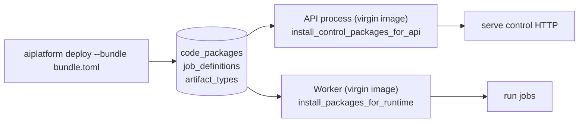

# ai-platform

A small platform for running domain AI workflows. The platform is the
orchestrator — catalogs (JobDefinitions, ArtifactTypes, CodePackages),
a worker that pip-installs domain wheels at boot, and a typed
TypeScript SDK any domain UI consumes. Domains live in their own
repos; deploying one is a single `aiplatform deploy` command.

The reference domain is [`sepoul/math-app`](https://github.com/sepoul/math-app)
(math_qa + math_conversation jobs, math-ui frontend). Replace it with
your own — that's the friend-test.



See [`docs/architecture.md`](docs/architecture.md) for the full
diagram set, [`docs/concepts/platform-design.md`](docs/concepts/platform-design.md)
for the conceptual contract.

## Quick start

```bash
cp .env.example .env       # add ANTHROPIC_API_KEY etc.
docker compose up --build
```

That brings up:

- **api** — FastAPI control plane on `localhost:8000`
- **worker** — default-runtime worker, pre-installed with the
  synthetic `_demo` domain so the stack is functional out of the box
- **platform-ui** — catalog browser + jobs inspector on `localhost:3001`

Submit a demo job:

```bash
curl -s -X POST -H 'content-type: application/json' \
    -d '{"job_type":"demo","message":"hello platform"}' \
    http://localhost:8000/jobs/runs/submit
```

Bring up a real domain (the math one):

```bash
git clone https://github.com/sepoul/math-app.git ../math-app
cd ../math-app/packages/math-qa && uv build --wheel
cd ../math-conversation && uv build --wheel
cd ../..
uv run aiplatform deploy \
    --bundle packages/math-qa/bundle.toml \
    --api-url http://localhost:8000
uv run aiplatform deploy \
    --bundle packages/math-conversation/bundle.toml \
    --api-url http://localhost:8000
# Restart workers; they'll pip-install the wheels from the catalog.
```

## What's in this repo

```
packages/              # BACKEND — the Python platform (a uv workspace)
  core/                #   ai_platform — shared substrate (storage, compute, catalogs)
  api/                 #   FastAPI control plane
  worker/              #   execution-plane worker
  _demo/               #   synthetic baseline domain (echo job)
sdk-ts/                # SDK — @sepoul-packages/sdk typed TS client + Next.js BFF helper
platform-ui/           # FRONTEND — domain-free admin SPA
docker/                # DEVOPS — platform image Dockerfiles (context = repo root)
infra/                 # DEVOPS — Hetzner box (OpenTofu) + redeploy script
scripts/               # TOOLING — dev/run/test helpers
supabase/              # DB — SQL migrations
docs/                  # DOCS — see docs/README.md (mkdocs site)
tests/                 # platform test suite
```

`docker-compose*.yml` + `.dockerignore` stay at the root (compose + the
prod box's `redeploy.sh` expect them there).

Real domains do **not** live here. They live in their own repos and
arrive at boot via the CodePackage catalog. The platform image
contains zero domain code in production.

## Documentation

- [`docs/architecture.md`](docs/architecture.md) — system overview with diagrams
- [`docs/concepts/`](docs/concepts/) — the conceptual model
- [`docs/guides/`](docs/guides/) — how to deploy a domain, run locally, etc.
- [`docs/reference/`](docs/reference/) — backends, typed clients
- [`docs/operations/`](docs/operations/) — deploying the platform itself
- [`docs/project/`](docs/project/) — team conventions, roadmap

## Storage backends

`BACKEND` env var selects the storage substrate. All three implement
the same Protocol surface:

| `BACKEND` | What | When |
|---|---|---|
| `local` (default) | JSON on disk under `LOCAL_DATA_DIR` | local dev |
| `b2` | Backblaze B2 | small prod / personal |
| `supabase` | Postgres + Supabase Storage | shared prod |

Details: [`docs/reference/storage-backends.md`](docs/reference/storage-backends.md) and [`docs/reference/compute-backends.md`](docs/reference/compute-backends.md).

## Compute backends

`COMPUTE` env var selects how the API hands jobs to workers:

| `COMPUTE` | Worker | When |
|---|---|---|
| `poll` (default) | separate process polls the job repo | compose, prod |
| `thread` | in-process | single-machine dev |
| `celery` | broker-driven | scale-out (with redis) |

Details: [`docs/reference/storage-backends.md`](docs/reference/storage-backends.md) and [`docs/reference/compute-backends.md`](docs/reference/compute-backends.md).

## Run on the host (no docker)

```bash
./scripts/dev.sh                   # api + worker, tagged logs, one terminal
./scripts/api.sh                   # uvicorn on 127.0.0.1:8000
./scripts/api.sh --reload          # extra args go through to uvicorn
./scripts/worker.sh                # poll loop
./scripts/worker.sh --once         # one job then exit
./scripts/test.sh                  # pytest, args forwarded
```

Each script auto-picks the project venv (`./.venv` first), loads
`.env`, defaults `BACKEND=local` with `LOCAL_DATA_DIR=./mathdata`.

## Tests

```bash
./scripts/test.sh
# or
uv run pytest tests/
```

## License

TBD.
