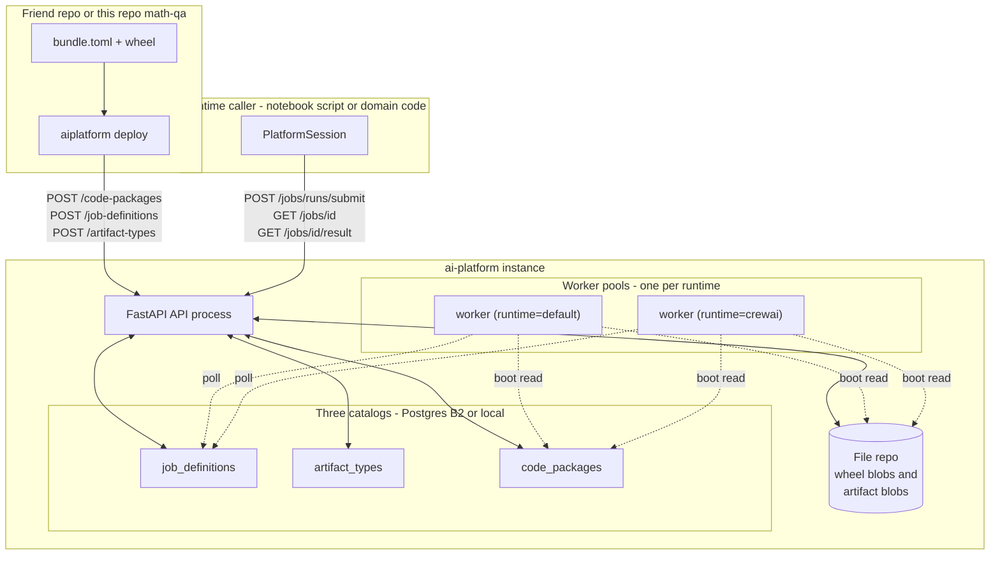
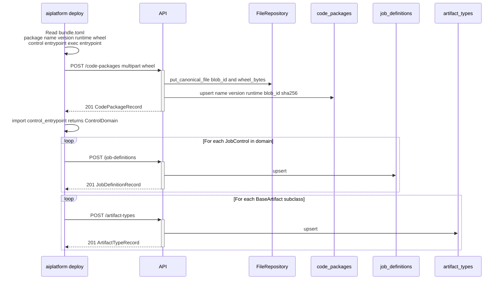
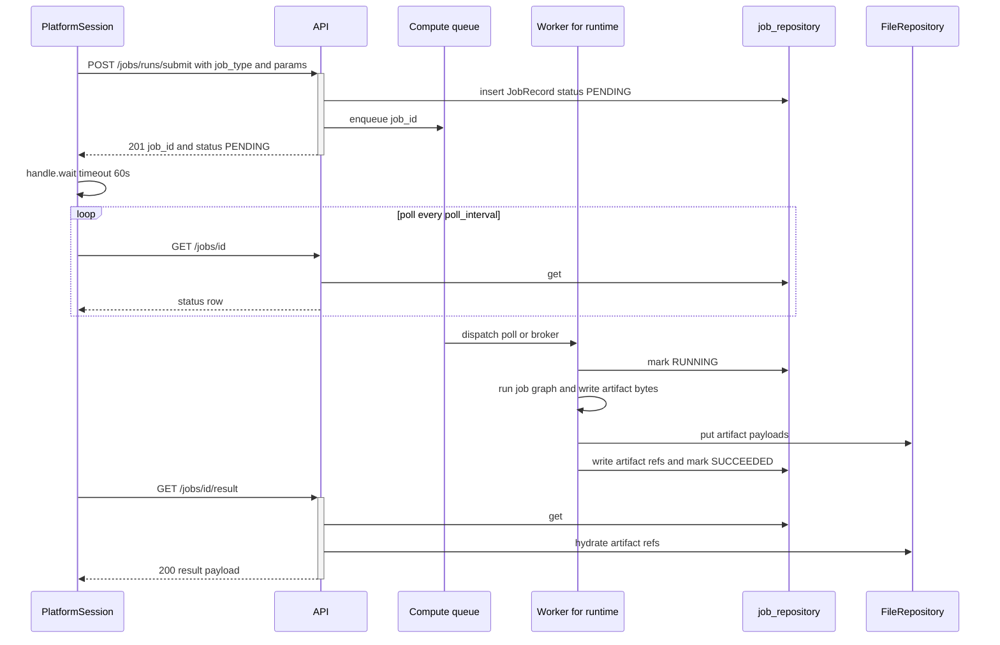
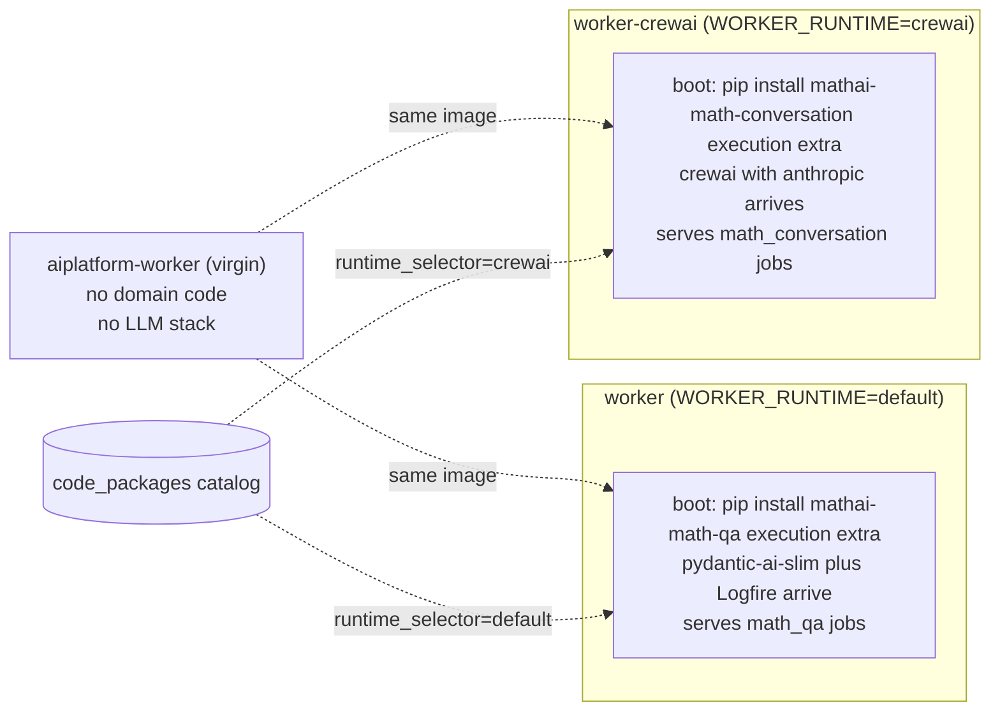
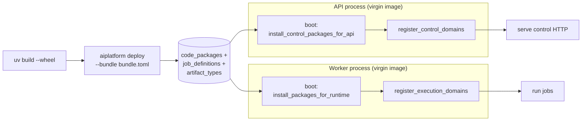

# Architecture

Central, "how the platform actually works today" overview. Read this
first if you're trying to understand the codebase as it stands at HEAD;
the operational guides in this directory then go deeper on individual
seams (jobs, prompts, compute, storage, etc).

For the *conceptual contract* (the planes, the ownership model, the
why), see [`platform_design.md`](concepts/platform-design.md). This doc is the
*implementation snapshot* — what's wired up, where it lives, how a
request flows through it.

---

## 1. What is this?

`ai-platform` is a Python platform for running domain AI workflows
("jobs"). The split that makes it a *platform* and not a monolith:

- **Core platform** (`packages/core`, `packages/api`, `packages/worker`)
  knows nothing about any specific domain. It ships generic catalogs
  (JobDefinitions, ArtifactTypes, CodePackages), a job lifecycle
  (submit → run → result), and a runtime substrate.
- **Domain packages** live in their own repos. The math domain (math_qa,
  math_conversation) lives in [`sepoul/math-app`](https://github.com/sepoul/math-app);
  this repo ships a synthetic `packages/_demo` baseline only.
- **Friend test**: a third party ships their domain as a wheel + a
  `bundle.toml` and runs `aiplatform deploy` against a running
  platform instance. The platform installs the wheel on its worker(s)
  on boot and starts serving the friend's jobs. No platform code
  changes, no image rebuild — math-app's own CI does exactly this.

---

## 2. System map

**Plane split** ([`concepts/platform-design.md`](concepts/platform-design.md) §2 has the
contract; this is the realization):

- **Control plane** = API process + the three catalogs. Knows
  *what* jobs exist and what shape their I/O has. Never executes
  user code.
- **Execution plane** = worker pools. Pulls work, runs the graph,
  writes artifact bytes to storage, reports state back to the
  control plane.
- **Storage plane** = file repo + structured repos. Bytes (wheels,
  artifacts) live here; the control plane only ever holds metadata
  + pointers.

---

## 3. The three catalogs

Every persisted piece of the platform's "what's deployed" state lives
in one of three catalogs. All three share a shape: keyed
`(name, version)` via `id = "{name}@{version}"`, idempotent upsert,
typed record + JSON Schema for its payload.

| Catalog | What it records | Written by | Read by |
|---|---|---|---|
| `job_definitions` | A runnable: schemas (input + result), gates, runtime selector, code entrypoint string | Boot auto-deploy (control.py); `POST /job-definitions` (CLI / friend) | API serves it; future routing cutover (today routing uses the in-memory `_job_controls` dict) |
| `artifact_types` | A `BaseArtifact` subclass: discriminator name + JSON Schema + owning domain | Boot auto-deploy; `POST /artifact-types` | API for catalog browse; future SDK / wheel-driven hydration |
| `code_packages` | An installable wheel: name + version + runtime + blob_id + sha256 + size | `POST /code-packages` (CLI / friend; multipart upload) | Worker on boot — downloads + sha256-verifies + `pip install`s |

Key files:

- [`packages/core/src/ai_platform/workspace/storage/structured/job_definition_repository.py`](../packages/core/src/ai_platform/workspace/storage/structured/job_definition_repository.py)
- [`packages/core/src/ai_platform/workspace/storage/structured/artifact_type_repository.py`](../packages/core/src/ai_platform/workspace/storage/structured/artifact_type_repository.py)
- [`packages/core/src/ai_platform/workspace/storage/structured/code_package_repository.py`](../packages/core/src/ai_platform/workspace/storage/structured/code_package_repository.py)

Service layer (validation + orchestration over the repo):

- `jobs/job_definition_service.py` — validates `runtime_selector ∈ {default, crewai}` and id-vs-name@version consistency.
- `jobs/artifact_type_service.py` — validates non-empty name + domain.
- `jobs/code_package_service.py` — owns the dual write (blob bytes via `FileRepository` + row via the catalog); sha256-verifies on download.

Backends ([`packages/core/src/ai_platform/workspace/storage/backends.py`](../packages/core/src/ai_platform/workspace/storage/backends.py))
plug all three into a `BACKEND` switch: `local` (filesystem JSON),
`b2` (Backblaze), `supabase` (Postgres + Supabase Storage).

---

## 4. Lifecycle: deploy → install → run

### 4.1 Bundle deploy

A friend runs `aiplatform deploy --bundle bundle.toml --api-url http://platform:8000`
(or invokes `ai_platform.bundle.deploy_bundle` programmatically).

Order matters: **CodePackage first** — bytes must land before any
worker reads the catalog row that points at them. JobDefinitions +
ArtifactTypes are independently idempotent; partial failure is "re-run
the command".

[`packages/core/src/ai_platform/bundle/__init__.py`](../packages/core/src/ai_platform/bundle/__init__.py)
holds the orchestration; [`packages/core/src/ai_platform/bundle/cli.py`](../packages/core/src/ai_platform/bundle/cli.py)
is the argparse + pretty-print wrapper.

### 4.2 Worker boot

When a worker starts (entrypoint at [`packages/worker/src/ai_platform/entrypoints/worker.py`](../packages/worker/src/ai_platform/entrypoints/worker.py)),
it pulls every CodePackage row for its runtime and pip-installs the
ones it doesn't already have:

```mermaid
sequenceDiagram
    participant W as Worker process
    participant CPC as code_packages
    participant FR as FileRepository
    participant Pip as pip subprocess

    W->>W: bootstrap_workspace() reads BACKEND env
    W->>+CPC: list(runtime_selector=default)
    CPC-->>-W: list of CodePackageRecord
    loop For each record
        W->>W: importlib.metadata.version(name)
        alt version matches catalog
            W->>W: log already installed, skipping
        else not installed or version mismatch
            W->>+FR: get_canonical_file_bytes(blob_id)
            FR-->>-W: wheel_bytes
            W->>W: verify sha256
            W->>+Pip: pip install wheel path
            Pip-->>-W: rc=0
            W->>W: log Installed CodePackage id
        end
    end
    W->>W: register_execution_domains resolves entrypoints
    W->>W: compute.start_worker enters run loop
```

Best-effort: a single install failure logs + continues; a failed
`list()` (DB down) skips the install pass entirely. The worker still
serves the JobDefinitions whose code is baked into its image. See
[`packages/core/src/ai_platform/jobs/code_package_install.py`](../packages/core/src/ai_platform/jobs/code_package_install.py).

### 4.3 Job submission

A runtime caller uses `PlatformSession` (or hits the API directly):

`PlatformSession` ([`packages/core/src/ai_platform/session/session.py`](../packages/core/src/ai_platform/session/session.py))
is just a typed httpx wrapper over the API; it owns the connection,
exposes the three catalog reads, and gives `JobHandle.wait()` /
`.result()` for lifecycle.

---

## 5. Runtime separation

Two worker pools exist for one reason: **otel-sdk pin conflict** —
Logfire (used by `pydantic_ai` for tracing) needs
`opentelemetry-sdk >= 1.39`; CrewAI pins `< 1.35`. They can't share
an interpreter.

In prod, both pools run **the same virgin `aiplatform-worker` image**.
The only difference is `WORKER_RUNTIME` env + which wheels the catalog
serves to each pool:

Each worker reads `WORKER_RUNTIME` env, queries the catalog for that
runtime, installs the wheels, then registers only that runtime's
domains. The otel-sdk pin conflict (Logfire `>=1.39` vs CrewAI
`<1.35`) lives at the **wheel-extras level** now, not the image level
— each runtime's wheels pull a different LLM stack, but the image
they install into is identical.

A friend's domain joins one of the two existing runtimes by declaring
`package.runtime = "default" | "crewai"` in its `bundle.toml`, and
must put its runtime-side deps under an `[execution]` extra (the
platform install pass appends `[execution]` to the install target).
Adding a third runtime means extending `KNOWN_RUNTIMES` in
[`packages/core/src/ai_platform/jobs/job_definition_service.py`](../packages/core/src/ai_platform/jobs/job_definition_service.py)
— no new image required.

---

## 6. Platform and domain are separate everywhere

**Both** the worker and the API images in prod now carry zero domain
code. The platform's own domains (math-qa, math-conversation) arrive
at boot via the CodePackage catalog — **the same way a friend's
domain does**. There is no longer a special path for "platform
domains" vs "friend domains"; they're the same path.

The shape per process:

Same install loop on both sides; the only difference is the
extras + filter:

- **Worker** queries the catalog for one `runtime_selector` and
  installs each wheel **with `[execution]`** so the LLM stack
  (pydantic-ai-slim / crewai) lands.
- **API** queries the catalog with no filter and installs each wheel
  **without** `[execution]` — control modules only. The API stays
  engine-free; the `import_guard` enforces this independently.

What this means in practice:

- **CI build matrix** produces only platform images:
  `aiplatform-api`, `aiplatform-worker` (virgin), `math-ui`,
  `platform-ui`. None know about any specific domain.
- **Adding or removing a domain** is a single `aiplatform deploy`
  call. No image rebuild, no compose change, no platform PR.
- **Local-dev convenience** (`docker compose up`) still bakes
  math-qa + math-conversation into worker images via
  `Dockerfile.worker-domain`, and into the API image via path-source
  installs, so a fresh box with an empty catalog still works. The
  prod compose **does not** use either of those shortcuts.

**Discovery is catalog-driven.** The API and worker entrypoints
both consult the catalog for the import list after the install pass:

- API: `control_registers_from_catalog(jd_service)` reads every
  JobDefinition row, dedups by `control_entrypoint`, imports each.
- Worker: `execution_registers_from_catalog(jd_service, runtime)`
  filters by `runtime_selector`, dedups by `code_entrypoint`, imports each.

`composition_root._DOMAINS` remains as a *cold-boot fallback only*:
on a fresh box with an empty catalog (before any `aiplatform deploy`
has landed), the hardcoded list lets the platform's baseline domains
come up. Post first-deploy, the catalog is the source of truth and
adding a new domain is purely a deploy operation — no edit to this
file.

---

## 7. Key files

The pieces a new reader needs to find, mapped to where they live.

| Topic | Where |
|---|---|
| Bundle deploy CLI + orchestration | `packages/core/src/ai_platform/bundle/{cli,manifest,__init__}.py` |
| PlatformSession + JobHandle | `packages/core/src/ai_platform/session/session.py` |
| Three catalogs (records) | `packages/core/src/ai_platform/workspace/storage/structured/{job_definition,artifact_type,code_package}_repository.py` |
| Three catalogs (Supabase impl) | `packages/core/src/ai_platform/workspace/storage/structured/supabase.py` |
| Three services | `packages/core/src/ai_platform/jobs/{job_definition,artifact_type,code_package}_service.py` |
| Worker boot install | `packages/core/src/ai_platform/jobs/code_package_install.py` |
| Worker entrypoint | `packages/worker/src/ai_platform/entrypoints/worker.py` |
| API app + router wiring | `packages/api/src/ai_platform/api/app.py` |
| API routers | `packages/api/src/ai_platform/api/routers/{jobs,job_runs,job_definitions,artifact_types,code_packages,...}.py` |
| Runtime DI singletons | `packages/core/src/ai_platform/runtime/registry.py` |
| Backend factory | `packages/core/src/ai_platform/workspace/storage/backends.py` |
| Postgres schema | `supabase/migrations/000{1,3,4,5}*.sql` |
| Composition root (which domain runs on which runtime) | `packages/core/src/ai_platform/composition_root.py` |

---

## 8. Loose ends + on-deck

What's deliberately not coupled yet, so the next person extending the
platform doesn't trip:

- **`composition_root._DOMAINS` remains as a cold-boot fallback.**
  Catalog-driven discovery is the primary path
  (`control_registers_from_catalog` and `execution_registers_from_catalog`,
  driven by the new `JobDefinitionRecord.control_entrypoint` field).
  The hardcoded list still kicks in on a fresh box before any
  `aiplatform deploy` has populated the catalog. After the repo
  split (NEXT_BEST_STEPS §7q Phase 3) it shrinks to a synthetic
  demo domain, then to `[]`.
- **JobDefinition ↔ CodePackage.** A JobDefinition row carries
  `code_entrypoint` as a free string. There's no foreign key into
  `code_packages` and the worker doesn't verify the entrypoint
  resolves to *this* deployed package. Tightening this (an optional
  `code_package_ref`) is a substrate-level cleanup if/when it bites.
- **Catalog-driven routing cutover.** The API still resolves
  JobControls via the in-memory `_job_controls` dict populated at
  boot. The catalog row is recorded as a parallel artifact — when a
  friend POSTs a new JobDefinition, the API knows about the row but
  won't route to it until the next API restart. Live routing from
  the catalog is a future PR; pairs with the API-virgin item above.
- **`[execution]` extra convention.** The worker install pass appends
  `[execution]` to every wheel target. A friend's wheel that uses a
  different extra name installs the base package but skips its
  runtime stack (pip just warns). Documented in
  `packages/{math-qa,math-conversation}/bundle.toml`.
- **Wheel deps.** `pip install` runs with default dep resolution.
  Friends deploying to *their* platform decide their own dep set;
  there's no constraints/sandbox/signature check today.
- **Single Celery pool.** [`celery_app.py`](../packages/worker/src/ai_platform/entrypoints/celery_app.py)
  registers all runtimes in one pool — fine in dev, won't survive
  the otel pin conflict if Logfire + CrewAI ever load in the same
  process. Not wired into the CodePackage install path. The
  poll-based `worker.py` is the prod path.
- **Bundle versioning.** `bundle.toml`'s `package.version` becomes
  the version for *all three* records the bundle creates. A future
  manifest extension can decouple wheel version from job/artifact
  versions; nobody's needed it.

---

## See also

- [`platform_design.md`](concepts/platform-design.md) — the conceptual contract (planes, ownership, vocabulary).
- [`jobs_spec.md`](concepts/jobs.md) — job lifecycle deep-dive (states, checkpoints, gates).
- [`control_execution_split.md`](concepts/control-execution-split.md) — why control and execution are split, and the import rules that keep them split.
- [`compute_backends.md`](reference/compute-backends.md) — pluggable compute (poll / thread / celery).
- [`storage_backends.md`](reference/storage-backends.md) — pluggable storage (local / B2 / Supabase).
- [`onboarding_new_job_type.md`](guides/deploy-a-domain.md) — the cookbook for adding a domain workflow.
- [`deployment_hetzner.md`](operations/hetzner-deploy.md) — the prod box, images, redeploy script.
